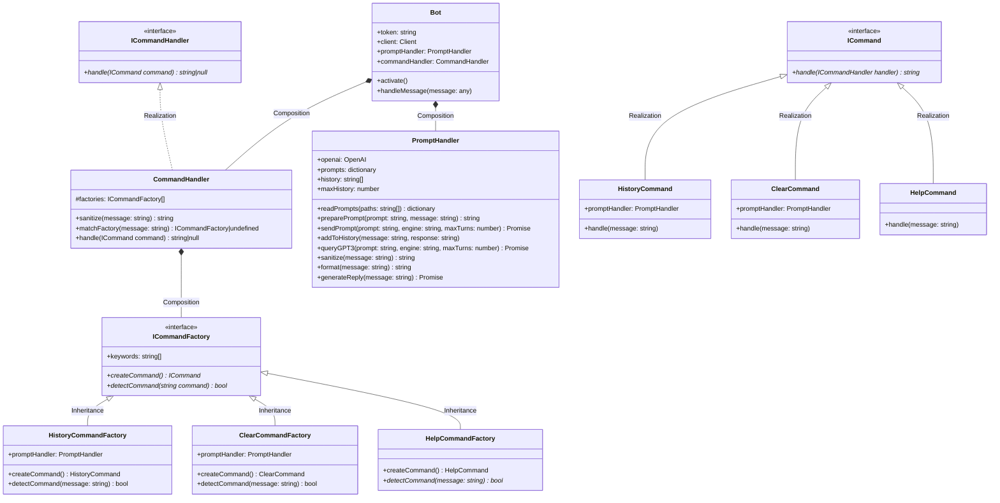

# Discord Copilot

A [GPT-3](https://openai.com/api/) powered chatbot tailored for code examples and software explanation, written in TypeScript using [Discord.js](https://discord.js.org/).
## Table of Contents
- [Architecture](#architecture)
    - [Repository Structure](#repository-structure)
    - [UML Diagram](#uml-diagram)

## Architecture
### Repository Structure
```
.
├── package.json
├── package-lock.json
├── README.md
├── src
│   ├── Bot.ts
│   ├── CommandHandler.ts
│   ├── CommandHandling
│   │   ├── Commands
│   │   │   ├── ClearCommand.ts
│   │   │   ├── HelpCommand.ts
│   │   │   ├── HistoryCommand.ts
│   │   │   └── index.ts
│   │   ├── ICommandFactory.ts
│   │   ├── ICommandHandler.ts
│   │   ├── ICommand.ts
│   │   └── index.ts
│   ├── index.ts
│   ├── PromptHandler.ts
│   └── prompts
│       ├── bothPrompt.txt
│       ├── classifyPrompt.txt
│       ├── codeExamplePrompt.txt
│       ├── elaboratePrompt.txt
│       └── plainEnglishPrompt.txt
└── tsconfig.json
```
### UML Diagram

